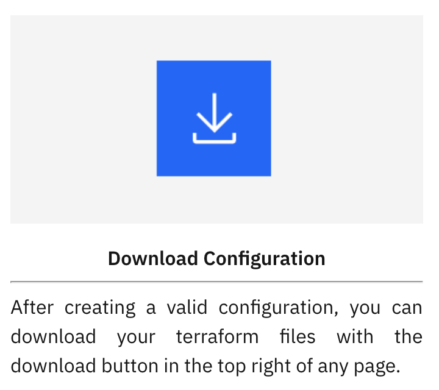
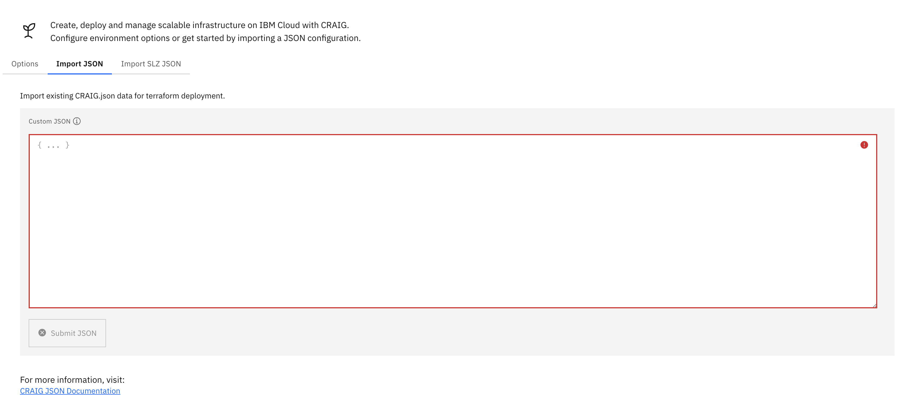
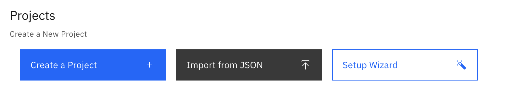

# Cloud Resource and Infrastructure-as-code Generator (CRAIG)

Cloud Resource and Infrastructure-as-Code Generator (or **CRAIG**) allows users to generate Terraform Deployable Architectures to create a fully customizable environment on IBM Cloud.

CRAIG simplifies the process of creating IaC through its GUI, which manages and updates interconnected resources as they are created.

CRAIG configures infrastructure using JSON to create full VPC networks, manage security and networking with VSI deployments, and create services, clusters, and manage IAM for an IBM Cloud Account. This JSON configuration can be imported to quick start environments, and can be downloaded as Terraform code directly from the GUI.

---
## CRAIG Usage Pattern

- The recommended use case is to deploy CRAIG to Code Engine both in Development account and Customer/POC account. 

- The development Account will have Power VS Workspaces for CRAIG to query when building Power VS projects.

- The PoC Environment will be configured within CRAIG Code Engine Instance on Development Account. Once ready, configuration template can be uploaded to Schematics for automated provisioning and internal testing.

- After internal testing is complete, PoC Environment template can be: 
    - downloaded from CRAIG _(see [Downloading CRAIG Configuration](#downloading-craig-configuration) section)_
    - or copied using the `craig.json` _(see [Copying JSON from within CRAIG](#copying-json-from-within-craig) section)_

- PoC Environment `craig.json` template is transferred over to Customer/PoC Account's  CRAIG Code Engine Instance using CRAIG's [Import JSON Feature](#importing-json-into-craig), then uploaded to Schematics again for PoC Infrastructure.

- See _[Integrating Schematics with CRAIG documentation](./schematics-how-to.md)_ for more information on how to Integrate CRAIG with Schematics.

 

---
## Installing CRAIG

See the [main README for installation instructions](../README.md#installation). The recommended approach is to [deploy CRAIG in IBM Code Engine](../README.md#deploying-to-ibm-code-engine).

---
## Using CRAIG

1. _Recommended:_ [CRAIG Tutorial Video](#craig-tutorial-video)
2. [Downloading CRAIG Configuration](#downloading-craig-configuration)
3. [Copying JSON from within CRAIG](#copying-json-from-within-craig)
4. [Importing JSON into CRAIG](#importing-json-into-craig)

---
## CRAIG Tutorial Video

[Follow this tutorial](https://ibm.box.com/v/craigTutorialVideo) for step-by-step instructions on how to get started with CRAIG.

---

## Downloading CRAIG Configuration

- Users can download their configuration as a terraform directory, including all specified networking and resource settings, as long as they do not have any outstanding errors within their CRAIG environment.

- Users can download their configuration by clicking the download icon located in the top navigation bar of the CRAIG GUI, which will download in the form of a `craig.zip` file.

- After unzipping `craig.zip`, users can find the `craig.json` file within the contained folder which can be used to import the custom configuration back into CRAIG.

 

---

## Copying JSON from within CRAIG

Alternatively, the `craig.json` can be quickly viewed, copied, or overrided directly within the CRAIG application by either:

1. Navigating to the Projects page and hitting the `View Configuration` button under your selected Project gives you the option to either:

    - Copy your `craig.json` output directly
    - Override your configuration by allowing you to edit your `craig.json` file manually _(not recommended)_.
2. Navigating to the Summary Page, users can copy their `craig.json` output for future use.

---

## Importing JSON into CRAIG

After a CRAIG configuration has been created and downloaded, in the archive of Terraform scripts is a file called `craig.json`. This file can be used to create a duplicate environment.

For more information on how CRAIG uses JSON, please refer to the _JSON Documentation_ page within the CRAIG application `/docs/json`. 

There are two options for importing existing configurations into CRAIG:
1. From the Options Page, click the `Import JSON` tab

    

 

2. From the Projects Page, click the `Import from JSON` button

    

 

---

