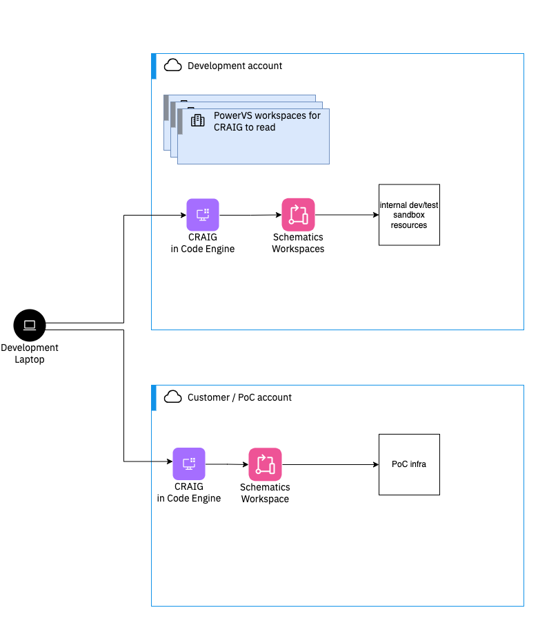

# Cloud Resource and Infrastructure-as-code Generator (CRAIG)

Cloud Resource and Infrastructure-as-Code Generator (or **CRAIG**) allows users to generate Terraform Deployable Architectures to create a fully customizable environment on IBM Cloud.

CRAIG simplifies the process of creating IaC through its GUI, which manages and updates interconnected resources as they are created.

CRAIG configures infrastructure using JSON to create full VPC networks, manage security and networking with VSI deployments, and create services, clusters, and manage IAM for an IBM Cloud Account. This JSON configuration can be imported to quick start environments, and can be downloaded as Terraform code directly from the GUI.

- [CRAIG Public Github Repository](https://github.com/IBM/CRAIG)

---
## CRAIG Usage Pattern



- Recommended use case is to deploy CRAIG to Code Engine both in Development account and Customer/POC account. 

- Development Account will be used to configure PowerVS Workspaces for CRAIG to use.
    - _see [Power VS Workspace Deployment](#power-vs-workspace-deployment) section for more information._

- PoC Environment will be configured within CRAIG Code Engine Instance on Development Account. Once ready, configuration template can be uploaded to Schematics for automated provisioning and internal testing.

- After internal testing is complete, PoC Environment template can be: 
    - downloaded from CRAIG _(see [Downloading CRAIG Configuration](#downloading-craig-configuration) section)_
    - or copied using the `craig.json` _(see [Copying JSON from within CRAIG](#copying-json-from-within-craig) section)_

- PoC Environment `craig.json` template is transferred over to Customer/PoC Account's  CRAIG Code Engine Instance using CRAIG's [Import JSON Feature](#importing-json-into-craig), then uploaded to Schematics again for PoC Infrastructure.

- See _[Integrating Schematics with CRAIG documentation](https://github.ibm.com/platinum-developer-tools/powervs-coe-docs/blob/mvp-docs/mvps/schematics-how-to.md)_ for more information on how to Integrate CRAIG with Schematics.

<br clear="right"/>

---
_Recommended Deployment Solution:_ [Deploying CRAIG in IBM Code Engine](#deploying-craig-in-ibm-code-engine)

For instructions on how to run CRAIG locally instead of using Code Engine, see the CRAIG documentation for the following:

 - [Running CRAIG Application Locally](https://github.com/IBM/CRAIG?tab=readme-ov-file#running-craig-application-locally)
 - [Setting Up CRAIG Development Environment](https://github.com/IBM/CRAIG?tab=readme-ov-file#setting-up-craig-development-environment)
 - [Building Local CRAIG Container Image](https://github.com/IBM/CRAIG?tab=readme-ov-file#building-local-container-image)

---

## Deploying CRAIG in IBM Code Engine
[CRAIG's deploy.sh script](https://github.ibm.com/platinum-developer-tools/CRAIG/blob/main/deploy.sh) deploys CRAIG to IBM Cloud Code Engine. The user running this command must have sufficient permissions to provision a Code Engine project, application, image build, and secrets. In addition, this API key must be able to create a IBM Container Registry namespace. See below for a simple use case using the default parameters.

CRAIG uses existing Power VS workspaces in the account to query zone specific items such as images, hardware, etc. If these workspaces are not configured CRAIG will use a static list which may include options that are not available in a specific zone. The [Power VS Workspace Deployment](#power-vs-workspace-deployment) section overs the configuration of these Power VS workspaces. If the workspace query functionality is desired, the workspaces should be created before deploying CRAIG in Code Engine.

#### Prerequisites for running deploy.sh from IBM Cloud Shell (recommended)
>* An API key must be provided that will be used for CRAIG's integration with IBM Cloud Schematics and Power Virtual Server Workspaces. This API key will also be used for IBM Code Engine's access to the IBM Container Registry. See later sections in this document about Schematics and Power Virtual Server integrations for more information.

#### Prerequisites for running deploy.sh outside of IBM Cloud Shell
>* The `ibmcloud` CLI must be [installed](https://cloud.ibm.com/docs/cli?topic=cli-install-ibmcloud-cli)
>* `ibmcloud login` must be run before invoking the script
>* An API key must be provided that will be used for CRAIG's integration with IBM Cloud Schematics and Power Virtual Server Workspaces. This API key will also be used for IBM Code Engine's access to the IBM Container Registry. See later sections in this document about Schematics and Power Virtual Server integrations for more information.
>* [jq](https://jqlang.github.io/jq/) v1.7 or higher

#### Downloading deploy.sh in IBM Cloud Shell
From within IBM Cloud Shell run the following two commands to download the deploy.sh script and make it executable:
```bash
wget https://raw.githubusercontent.com/IBM/CRAIG/main/deploy.sh
chmod 755 deploy.sh
```

### Running the deploy script
By default the script will securely prompt you for your API key. It may also be read from an environment variable or specified as a command line argument. See the `deploy.sh -h` usage for more information.

```bash
./deploy.sh
```

The deploy script can also create the Power Virtual Server workspaces and automatically integrate them with the CRAIG deployment. The deploy script uses a Schematics workspace and Terraform to drive the creation and deletion of the Power Virtual Server workspaces. Specify the `-z` parameter to automatically create the Power Virtual Server workspaces:
```bash
./deploy.sh -z
```

This script can also delete the resources when the delete flag `-d` is passed

```bash
./deploy.sh -d
```

For the full list of parameters which allows full customization of the IBM Code Engine deployment, specify the `-h` parameter:
```
./deploy.sh -h
```

Note, if you've specified custom parameters beyond the default values for your deploy script, then you must specify them after the delete flag in order to delete all resources properly. 

For example, to delete the CRAIG Code Engine and Container Registry resources with custom parameters resource group: `test-rg`, namespace: `craig-demo-namespace`, and project name: `craig-demo-project`, then the script must be specified as followed:

```bash
./deploy.sh -d -g test-rg -n craig-demo-namespace -p craig-demo-project
```

---

### Bring Your Own Workspace

To bring your own Power VS Workspace into CRAIG to fetch images, you will need to set a field in your `.env` file with the following format. To see an example, see [.env.example](./.env.example)

```
POWER_WORKSPACE_<zone-of-workspace>=<workspace-guid>
```
To find the GUIDs and locations of your workspaces, the following command can be run in a terminal window or an IBM Cloud Shell using the [IBM Cloud CLI](https://cloud.ibm.com/docs/cli?topic=cli-getting-started): 

```
ibmcloud resource service-instances --service-name power-iaas --output json | jq -r '.[]? | "\(.guid), \(.name), \(.region_id)"'
```

---
## Using CRAIG

1. _Recommended:_ [CRAIG Tutorial Video](#craig-tutorial-video)
2. [Downloading CRAIG Configuration](#downloading-craig-configuration)
3. [Copying JSON from within CRAIG](#copying-json-from-within-craig)
4. [Importing JSON into CRAIG](#importing-json-into-craig)

---
## CRAIG Tutorial Video

[Follow this tutorial](https://ibm.box.com/v/craigTutorialVideo) for step-by-step instructions on how to get started with CRAIG.

---

## Downloading CRAIG Configuration


- Users can download their configuration as a terraform directory, including all specified networking and resource settings, as long as they do not have any outstanding errors within their CRAIG environment.

- Users can download their configuration by clicking the download icon located in the top navigation bar of the CRAIG GUI, which will download in the form of a `craig.zip` file.

- After unzipping `craig.zip`, users can find the `craig.json` file within the contained folder which can be used to import the custom configuration back into CRAIG.

<br clear="right"/>

---

## Copying JSON from within CRAIG


Alternatively, the `craig.json` can be quickly viewed, copied, or overrided directly within the CRAIG application by either:

1. Navigating to the Projects page and hitting the `View Configuration` button under your selected Project gives you the option to either:

    - Copy your `craig.json` output directly
    - Override your configuration by allowing you to edit your `craig.json` file manually _(not recommended)_.
2. Navigating to the Summary Page, users can copy their `craig.json` output for future use.


---

## Importing JSON into CRAIG

After a CRAIG configuration has been created and downloaded, in the archive of Terraform scripts is a file called `craig.json`. This file can be used to create a duplicate environment.

For more information on how CRAIG uses JSON, please refer to the _JSON Documentation_ page within the CRAIG application `/docs/json`. 


There are two options for importing existing configurations into CRAIG:
1. From the Options Page, click the `Import JSON` tab

    

<br clear="right"/>

2. From the Projects Page, click the `Import from JSON` button

    

<br clear="right"/>

---

