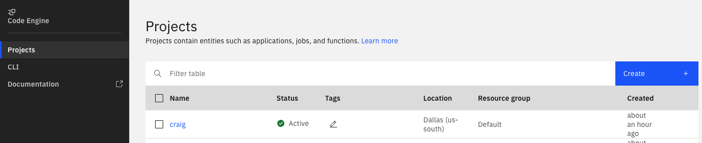

# CRAIG in IBM Code Engine

The default setup of CRAIG in Code Engine pulls the latest CRAIG source, builds a container image, and creates the serverless application. All of this activity is done in a Code Engine project. The default CRAIG Code Engine project looks like this:



## Updating CRAIG
CRAIG is continually being enhanced with new features. To update your CRAIG deployment with the latest CRAIG code level, navigate to the `craig` project's image build. The navigation flow from the Code Engine project page is:
1. Click on the `craig` project name
2. Click `Image builds` on the left panel
3. Click the `Image build` tab in the main panel
4. Click the `imgbld-craig` build name

The image build panel looks like this:


To refresh the container image with the latest code, click the `Submit build` button and then the `Submit build` button on the right nav pop-over.

This will build a new container image with the latest CRAIG source. The next time the CRAIG application starts after a period of inactivity, it will use the new image.

### Redeploying the CRAIG instance
The new instance can also be deployed immediately by navigating to the `craig` application panel and clicking the `Redeploy` button.

The `craig` application panel can be reached from the `craig` project by clicking on the `Applications` left menu item and clicking the on the `craig` application name in the table. The application panel looks like this:


## Advanced source and container image management
The Code Engine image build and application settings can be used to manage the CRAIG source level being built and run.

* The `Branch name` field on the image build panel can be changed to build a specific CRAIG tag/release or a specific commit level.
* The output tab of the image build panel can be used to change the output container image name and tag. The image name and tag can also be set during image build submission. The container image tags can be changed from `latest` to something else like the CRAIG source image tag or the date the latest `main` branch was pulled and built.
* If different image container names or tags are used, the `Image reference` field on the `craig` application panel must be updated with the new image/tag name and the revision [redeployed](#redeploying-the-craig-instance) to run with the new image.

## Bring your own Power VS workspace

### Background
You can bring your own existing Power VS workspace into CRAIG which allows you to choose custom images for Power VSIs.

The IBM Code Engine deployment script will automatically create Power VS workspaces for CRAIG use when using the `-z` parameter. The script also allows specifying environment variables with the workspace IDs in a file with the `-e` parameter. In both cases the Power VS workspace zones and corresponding workspace IDs are placed in a Code Engine configmap.

### Modifying the configmap
If you want to bring your own workspace after CRAIG deployment in Code Engine you can update the configmap with the GUID of your workspace.

To find the GUIDs and locations of your workspaces, the following IBM Cloud CLI command can be run in a terminal window or an IBM Cloud Shell: 

```
ibmcloud resource service-instances --service-name power-iaas --output json | jq -r '.[]? | "\(.guid), \(.name), \(.region_id)"'
```

To modify the configmap to add your workspace GUID, click on `Secrets and configmaps` on left navigation pane of the Code Engine project. Click on the `craig-env` Configmap. Find the key that matches your workspace's zone and set your workspace's GUID as the value for the key. Click the `Save` button. The CRAIG instance can then be [redeployed](#redeploying-the-craig-instance) to pick up the configmap change.

If CRAIG was deployed without specifying `-z` or `-e`, a configmap can be manually created and set with the correct key-value for the zone. See the [.example.env](../.example.env) for the possible keys and the [IBM Code Engine documentation](https://cloud.ibm.com/docs/codeengine?topic=codeengine-configmap) for how to create the configmap and add the reference to the `craig` application.
