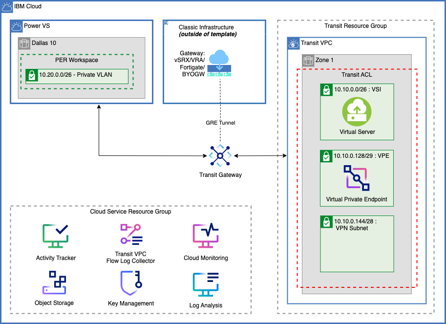

# Power VS PoC Classic

The Power VS PoC Classic environment is meant to facilitate a simple migration of AIX and IBM i servers to a Power Virtual Server workspace connected to a Classic Gateway Appliance through a transit gateway and GRE tunnel in the IBM Cloud POC Account. This allows demonstration of network communication and data migration across the network between the on-premises LPARs and the Power Virtual Server workspace. The diagram below shows the representative list of resources included in the default CRAIG template for this POC environment. Additional provisions suitable for the choice of migration method adopted in POC, backup of these systems, high availability or disaster recovery configurations need to be added in the project created from this template to meet POC requirements.

## Creating the Classic Gateway Appliance Manually

- Users can create their own Classic Gateway Appliance within IBM Cloud using the following catalog tile: [IBM Cloud Gateway Appliance](https://cloud.ibm.com/catalog/infrastructure/gateway-appliance)
- If the classic gateway is to be created later, than users should delete the GRE Tunnel from their template in CRAIG by editing their transit gateway on the `Connectivity` page.

- Users can find or create their Classic Gateway Appliance by navigating to the Gateway Appliances page in the IBM Cloud UI. 
   - From the IBM Cloud UI left navigation, select **Classic Infrastructure -> Network -> Gateway Appliances.**
   - Users can then order a new Gateway Appliance on this page, or select an existing Gateway Appliance.
   - **After selecting the Gateway Appliance, the `remote gateway IP` value used for the GRE tunnel should be the Private IP of the Gateway Appliance found on this page.**

## Default template resources that will be created

- **Resource Groups**
    -	Transit:  The transit resource group has all the auxiliary resources needed for external connectivity to Power VS resources.
    -	Power: The Power Resource Group has the Power VS workspace.
    -	Cloud Service: The Cloud Service Resource Group has the Activity Tracker, VPC Flow Log, Key Management, Cloud Monitoring, Log Analysis, Cloud Object Storage instances for VPC Flow Log, Activity Tracker, OS and data backup/archive files. 
- **Virtual Private Cloud (VPC)**: Private cloud with private subnets and a VSI which allows us to access the Power VS workspace. 
- **VPC Subnets**: Creates 3 subnets- vpn_zone_1, vsi_zone_1 and vpe_zone_1. Example CIDRs in the diagram are 10.10.0.144/28, 10.10.0.0/26 and 10.10.0.128/29
- **VPC Access Control Lists**: Rules to protect traffic inbound to and outbound from the VPC subnets. VPC ACLs cannot be associated with Power VS subnets.
- **Public Gateway**: Public gateway is attached to the vsi_zone_1 subnet for the VSIs to talk to the Internet
- **Transit Gateway**: To connect between the VPC environment, Power VS workspace and Classic Gateway Appliance
- **Cloud Object storage**: Instances for Transit VPC flow logs, Activity Tracker events, and storing the OS and data backup/archive files from the source environment.
- **IBM Key Protect**: For customer managed encryption keys
- **Activity Tracker**: To capture platform events for all user initiated activities on the cloud resources provisioned in the IBM Cloud POC account
- **Flow Log**: A Flow Logs collector for the Transit VPC
- **Cloud Monitoring**: To monitor platform metrics from all resources provisioned in the IBM Cloud POC account
- **Log Analysis**: To capture and manage operating system logs, application logs, and platform logs in the IBM Cloud POC account
- **Power VS workspace with PER**: Simpler connectivity option as PER solution includes a NAT device that makes it easier for Power VS to access other IBM Cloud Services private endpoints, such as Cloud Object Storage. 
- **Power VS Subnet**: 1 subnet is created within the workspace. Example CIDR in the diagram is 10.20.0.0/26
- **Virtual Private endpoint for Cloud Object storage in the VPC**: attached to the vpe_zone_1 subnet for accessing the COS from Power VS workspace, VPC and on-premises via private connectivity.
- **VPC Virtual Server Instance**: Attached to the vsi_zone_1 subnet. Can be used as a Jump/Bastion server and/or can be used for other utilities like squid proxy, NFS Server, etc.
- **Power Virtual Server images**: All AIX and IBMi images are preselected and available for use

## Configure the deployment using CRAIG

### CRAIG versions
This documentation uses the V2 CRAIG navigation. CRAIG users can switch between classic and V2 navigation by choosing the version from the top left menu button. Note that the forms fields and generated Terraform are the same regardless of the chosen navigation option.

### Initial project creation
To start configuring this deployment choose the "Create a Project" button from the Projects page.

Give the project a name and optional description, choose the "Power VS POC Classic" template from the initial template list, and click the "Create Project" button.

### Set public SSH keys
After the creation of the project you must provide the public SSH keys that will be used to access the VPC and Power VS VSIs.

To set the public SSH key value for the VPC VSI, click on the red `VPC Deployments` on the left navigation bar, then click on the red key icon. Fill in the public key value in the prompt and click the Save button.

To set the public SSH key value for Power VS VSIs, click on the red `Power VS` item on the left navigation bar, then click on the key icon. Click on the key icon, expand the SSH Keys section, fill in the public key value, and click the Save button. If you do not plan on using SSH to access Power VS VSIs, then you can delete the Power VS SSH Key from the project by clicking the Delete button.

### Set Classic GRE Tunnel Remote Gateway IP
After the creation of the project you must provide the remote gateway IP of the Classic Gateway Appliance within the GRE Tunnel connection of the transit gateway. To find your remote gateway IP, refer to the [Creating the Classic Gateway Appliance Manually section](#creating-the-classic-gateway-appliance-manually).

To set the remote gateway IP value for the GRE Tunnel, click on the red `Connectivity` item on the left navigation bar, then click on the `classic-gre-tunnel` icon. Fill in the remote gateway IP value, and click the Save button.  

#### On-premises network CIDR outside of 10.0.0.0/8
If you are using an on-premises network CIDR outside of the `10.0.0.0/8` range you will need to add inbound and outbound rules to the `transit-vsi` and `transit-vpe` security groups. These security groups can be found by clicking on `VPC Deployments` on the left navigation bar and then clicking on each security group icon.

### Activity Tracker
By default the template will create an IBM Cloud Activity Tracker in the us-south region. Since only one activity tracker is allowed per region in an account the project will fail to deploy if the account already has an Activity Tracker instance in the region. If the target account already has an Activity Tracker instance the project must be modified to not create an instance. Navigate to the the Activity Tracker by choosing `Cloud Services` from the left navigation bar and click on the `Activity Tracker` icon. Set `Create Activity Tracker Instance` to `False` and click the Save button.

## Additional customization
At this point the project should be ready to deploy. However, additional customizations to the default template resources can be done in CRAIG. The following list of resources are commonly customized before deployment.

### Resource prefix
The resources created by the template deployment will have a name prefix. To change the name prefix, click on the Option (gear) button on the left navigation bar. Change the prefix value and click the Save button.

### VPC network CIDR
To change CIDR of the VPC networks, click on `VPC Networks` on the left navigation bar. Click on the the network you would like to update, change the "Advanced Configuration" to true, de-select zones 2 and 3 from the Zones selector and press the Save button.

Finally, change the subnet CIDR and click the Save button next to the subnet name.

### Region and Power VS zone
The template defaults the IBM Cloud region and Power VS Zones for the resources. To change the IBM Cloud region and Power VS Zones, click on the Option (gear) button on the left navigation bar.

First change the Region selector to the preferred region.
Next, choose the Power VS zones in that region using the Power VS Zone multi-select list. Click the Save button.

**NOTE:** Only PER enabled Power VS zones should be used for PoCs. See the [Power Virtual Server documentation](https://cloud.ibm.com/docs/power-iaas?topic=power-iaas-per) for the current list of PER enabled zones.

After changing the region and zone(s) in the options, the existing Power VS workspace in the project needs to be changed. Click on `Power VS` in the left navigation bar, click on the name of the Power VS workspace (`dal10` by default) update the Availability Zone, choose the images from the `Image Names` selector, and click the Save button.

If any virtual servers were created in the template they will also need to be updated with the newly selected images. Click on each of the red Virtual Server icons, set their image, and click the save button for the VSI.

### Updating Power VS Images
The template defaults to preselecting all AIX and IBM i images within the Power VS Workspace. If images are not going to be used in deployment, they can be removed from the the template. Each unused image removed from the template will save about 25 seconds during the terraform apply of the environment. 

Images can be added/removed by clicking the `Power VS` section from the left navigation bar, selecting the name of the desired Power VS workspace (`dal10` by default), and updating the images selecting within the `Image names` dropdown field. Users can also add additional stock images beyond AIX and IBM i, by selecting any additional images desired here.

### Power Virtual Server network CIDR

To change the CIDR of a Power VS network, click on the `Power VS`icon in the left navigation bar, and click on the name of the Power VS workspace (`dal10` by default). Expand the subnet that you wish to modify, change the CIDR, and click the Save button.

### Power Virtual Server VSIs / LPARs

The template comes with all the AIX and IBM i stock images preselected in the Power VS Workspace. These stock images are provided by Power Virtual Server for their boot disk (rootvg or *SYSBAS). 

Users can add Power VS VSIs and storage volumes accordingly within their Power VS Workspace from the `Power VS` page. Specifications such as CPU, memory, storage, image version, and more can be customized in CRAIG before deployment.

_Note:_ Any additional storage volumes that are created and attached to a VSI will be blank and unformatted when the VSI is provisioned.

To add a new VSI, click on `Power VS` in the left navigation bar, then click the "Add Resource" (plus) button on the Power VS workspace, choose "Power Instance" for the deployment type, fill in the fields, and click the Submit button.

The VSI's storage volumes are customized using the Power VS Storage panel described in the next section. 

If a custom OVA boot image will be used for the VSI, the VSI should not be created using CRAIG. The project should be deployed without the VSIs that will use custom images. The deploy will create the Power VS workspace and all the other PoC infrastructure. The custom image can then be imported in to the Power VS workspace and the VSI can then be provisioned. For more information about custom OVAs see the [Power Virtual Server documentation](https://cloud.ibm.com/docs/power-iaas?topic=power-iaas-migration-strategies-power#migration-powervc-icos) and this [multi-disk AIX OVA creation document](https://community.ibm.com/community/user/power/blogs/samuel-matzek1/2023/10/26/multi-disk-aix-ova-creation-for-powervs-migration).

### Storage volumes in Power Virtual Server
To work with additional volumes, click on `Power VS` on the left navigation bar.

There are multiple ways to manage volumes in Power Virtual Server:

* To add new volumes to a virtual server or delete volumes attached to a virutal server, click on the virtual server's icon. In the right panel scroll down to work with the virtual server's volumes. New volumes can be added by clicking the plus icon above the Attached Volumes table. Volumes can be deleted by clicking on Trash icon on the the volume's row.
* To change volume attributes click on the volume's icon, edit the attributes, and click the save button.
* To add volumes that will not be attached to a virtual server, click the "Add Resource" (plus) button on the Power VS workspace, choose "Power Volume", fill in the attributes and click Submit.
* To remove volumes that are not attached to a virtual server, click on the volume's icon and click the delete button in the right panel.

### VPC VPN Server - Client to Site VPN
The VPC VPN Server used for client to site VPNs requires SSL/TLS certificates stored in a Secrets Manager instance. The Secrets Manager should be created outside of CRAIG and populated with the certificates before creating the VPN Server deployment in CRAIG.

1. Create a Secrets Manager instance and either [order public certificates](https://cloud.ibm.com/docs/secrets-manager?topic=secrets-manager-public-certificates&interface=ui
), [create private certificates](https://cloud.ibm.com/docs/secrets-manager?topic=secrets-manager-private-certificates&interface=ui
), or [import certificates](https://cloud.ibm.com/docs/secrets-manager?topic=secrets-manager-certificates&interface=ui). Consult the [VPC client-to-site server authentication documentation](https://cloud.ibm.com/docs/vpc?topic=vpc-client-to-site-authentication) to ensure the certificate authorities and certificates are created using values that are compatible with the VPN server.
2. Choose VPC Deployments from the menu and create a new security group for the VPN Server.
Create the security group in the `transit-rg` resource group.
Add the following rules to the group:

| Name            | Direction | CIDR      | Protocol | Port |
| --------------- | --------- | --------- | -------- | ---- |
| vpn-inbound-udp | inbound   | 0.0.0.0/0 | UDP      | 443  |
| vpn-inbound-tcp | inbound   | 0.0.0.0/0 | TCP      | 443  |
| vpn-outbound    | outbound  | 0.0.0.0/0 | ALL      | ALL  |

3. Create a VPN Server deployment
Set the VPN Server values using the following table as a guide.

| Field                   | Value                                                                                                                                                                                                            |
| ----------------------- | ---------------------------------------------------------------------------------------------------------------------------------------------------------------------------------------------------------------- |
| Resource group          | transit-rg                                                                                                                                                                                                       |
| VPC                     | transit                                                                                                                                                                                                          |
| Subnets                 | vpn-zone-1                                                                                                                                                                                                       |
| Security group          | security group created in step 3                                                                                                                                                                                 |
| Authentication method   | Username and Certificate                                                                                                                                                                                         |
| Certificate CRN         | The CRN of the Secrets Manager secret containing the certificate for the VPN Server.                                                                                                                             |
| Client CA CRN           | The CRN of the Secrets Manager secret containing the certificate for the VPN client.                                                                                                                             |
| Client CIDR Pool        | Specify a network CIDR that does not conflict with any on-premises network, the VPC network, or the Power VS network. The prefix length must be between 9 and 22 inclusive. The CIDR should also be a subnet of `10.0.0.0/8` to avoid additional security group and routing table changes. For example `10.60.0.0/22` does not conflict with the default VPC, Power VS, or on-premises networks in the template. | 
| Port                    | 443                                                                                                                                                                                                              |
| Protocol                | UDP                                                                                                                                                                                                              |
| Enable split tunneling  | True is recommended                                                                                                                                                                                              |
| Client idle timeout     | 600                                                                                                                                                                                                              |
| Client DNS Server IPs   | Leave empty                                                                                                                                                                                                      |
| Additional VPC Prefixes | Zone 1, add the CIDR specified in `Client CIDR Pool`                                                                                                                                                             |

4. After the VPN server is created, click on the VPN server icon to add routes. Routes are added by clicking the plus icon at the bottom of the VPN Server settings. Add the following route:

| Name    | Destination                                                             | Action    |
| ------- | ----------------------------------------------------------------------- | --------- |
| vpn-vsi | the VSI network CIDR (`10.10.0.0/26` by default in the template)        | Deliver   |

## Saving the configuration and deploying the resources

The configuration can be downloaded by clicking the download button in the top right of the screen. This downloads a zip of a file named craig.json and Terraform artifacts. The craig.json can be imported back into CRAIG for continued editing.

The project resources can be provisioned in the cloud using either IBM Cloud Schematics in the cloud account or a local Terraform install. CRAIG has integration to automatically upload and configure the deployment in IBM Cloud Schematics. [Click here](./schematics-how-to.md) for more information on using this deployment method.

Resources can also be provisioned using a local Terraform install. The downloaded zip contains the `main.tf` and other Terraform files needed to provision the resources.

### Inputs Required at Deployment Time
>**Note:** The following input fields (Terraform values) must be set in IBM Schematics or Terraform at Generate Plan / Apply Plan time.
>* `ibmcloud_api_key`: The IBM Cloud platform API key that will be used to deploy the project resources. See [Access Policies](access-policies.md) for access policies and account settings required for creating and managing resources created in CRAIG projects.

### Cost estimation
IBM Cloud Schematics provides a cost estimation for the project resources after running the `Generate Plan` step. See [the Schematics Integration document](./schematics-how-to.md) for more information.

## Post-deployment configuration

### GRE tunnel configuration
The template creates an unbound GRE tunnel on the transit gateway with the local and remote IPs for both the tunnel and the underlay network. After deployment the GRE tunnel must be configured in the gateway appliance using the gateway and tunnel IPs specified in the template.

### Virtual server configuration
After deploying the PoC resources additional configuration in the VSI operating systems is usually required. If any IBM i VSIs are deployed using the stock images, they also have [required post-deployment configuration](https://cloud.ibm.com/docs/power-iaas?topic=power-iaas-configuring-ibmi).

Any additional non-boot disk (rootvg, *SYSBAS, etc) volumes will be blank and require formatting, volume group restores, mount point configuration, ASP configuration, etc depending on the operating system and intended use case.

The VPC VSI can also be configured to serve utility purposes such as acting as an internet proxy for any Power VSIs, as a jump host, an NFS server, or any other utility functions.

### Configuring VPC VPN Server - Client to Site VPN users

If a VPC VPN Server was added to the configuration as documented with the `Username and Certificate` authentication mechanism, VPN users must have the correct access policies to log into the VPN.

The following steps can be used to create an access group with the appropriate access policy and add VPN users:

Create Access Group:
  - Manage -> Access (IAM) -> Access Groups -> Create +
  - Name the access group  _(i.e. VPN Users)_
  - Add users and/or service IDs as needed
  - Navigate to Access tab -> Assign access +
  - Create an access policy with the following:

| Service                            | Resources                          | Access          |
|-                                   |-                                   |-                |
| VPC Infrastructure Service   | All                                | Users of the VPN server need this role to connect to the VPN server          |
