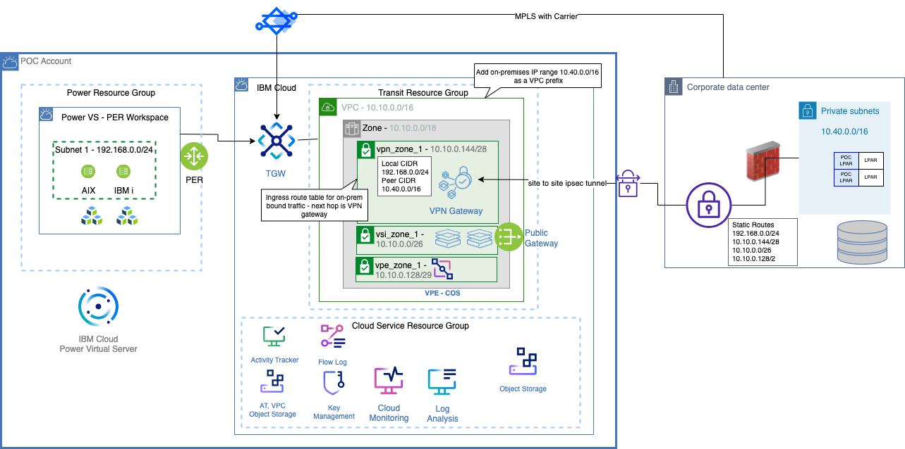

# Power VS PoC

The Power VS PoC environment is meant to facilitate a simple migration of AIX and IBM i servers from customer premises to a Power Virtual Server workspace connected via a VPN tunnel terminating on a VPC VPN Gateway in the IBM Cloud POC Account. This allows demonstration of network communication and data migration across the network between the on-premises LPARs and the Power Virtual Server workspace. The diagram below shows the representative list of resources included in the default CRAIG template for this POC environment. Additional provisions suitable for the choice of migration method adopted in POC, backup of these systems, high availability or disaster recorvery configurations need to be added in the project created from this template to meet POC requirements. 

## Default template resources that will be created

- **Resource Groups**
    -	Transit:  The transit resource group has all the auxiliary resources needed for external connectivity to Power VS resources.
    -	Power: The Power Resource Group has the Power VS workspace.
    -	Cloud Service: The Cloud Service Resource Group has the Activity Tracker, VPC Flow Log, Key Management, Cloud Monitoring, Log Analysis, Cloud Object Storage instances for VPC Flow Log, Activity Tracker, OS and data backup/archive files. 
- **Virtual Private Cloud (VPC)**: Private cloud with private subnets and VSIs which allows us to access the Power VS workspace. 
- **VPC Subnets**: Creates 3 subnets- vpn_zone_1, vsi_zone_1 and vpe_zone_1. Example CIDRs in the diagram are 10.10.0.144/28, 10.10.0.0/26 and 10.10.0.128/29
- **VPC Access Control Lists**: Rules to protect traffic inbound to and outbound from the VPC subnets. VPC ACLs cannot be associated with Power VS subnets.
- **Public Gateway**: Public gateway is attached to the vsi_zone_1 subnet for the VSIs to talk to the Internet
- **Transit Gateway**: To connect between the VPC environment, Power VS workspace and Direct Link Gateway
- **Direct Link Gateway**: To securely connect on-premises or other cloud provider locations linked to customer's choice of service providers to IBM Cloud private network backbone using the Direct Link Offerings 
- **VPC VPN Gateway**: Attached to vpn_zone_1 subnet for site to site ipsec policy based VPN connection between the on-prem location and the IBM Cloud POC account VPC. It does not support BGP for exchanging routing information or any packet inspection for securing the network traffic. On-Prem VPN Gateway needs to use the IP address of the VPC VPN Gateway to create the VPN connection.
- **Cloud Object storage**: Instances for Transit VPC flow logs, Activity Tracker events, and storing the OS and data backup/archive files from the source environment.
- **IBM Key Protect**: For customer managed encryption keys
- **Activity Tracker**: To capture platform events for all user initiated activities on the cloud resources provisioned in the IBM Cloud POC account
- **Flow Log**: A Flow Logs collector for the Transit VPC
- **Cloud Monitoring**: To monitor platform metrics from all resources provisioned in the IBM Cloud POC account
- **Log Analysis**: To capture and manage operating system logs, application logs, and platform logs in the IBM Cloud POC account
- **Power VS workspace with PER**: Simpler connectivity option as PER solution includes a NAT device that makes it easier for Power VS to access other IBM Cloud Services private endpoints, such as Cloud Object Storage. 
- **Power VS Subnet**: 1 subnet is created within the workspace. Example CIDR in the diagram is 192.168.0.0/24
- **Virtual Private endpoint for Cloud Object storage in the VPC**: attached to the vpe_zone_1 subnet for accessing the COS from Power VS workspace, VPC and on-premises via private connectivity.
- **VPC Virtual Server Instances (2)**: Attached to the vsi_zone_1 subnet. Can be used as a Jump/Bastion server and/or can be used for other utilities like squid proxy, NFS Server, etc.
- **Power Virtual Server instances (VSI)**: 1 AIX and 1 IBM i VSI within the Power VS workspace for the scope of the migration POC. VSIs in Power VS are also known as Logical Partitions (LPARs).

## Configure the deployment using CRAIG

### CRAIG versions
This documentation uses the classic CRAIG navigation. CRAIG users can switch between classic and V2 navigation by choosing the version from the top left menu button. Note that the forms fields and generated Terraform are the same regardless of the chosen navigation option.

### Initial project creation
To start configuring this deployment choose the "Create a Project" button from the Projects page.

Give the project a name and optional description, choose the "Power VS POC" template from the initial template list, and click the "Create Project" button.

### Set public SSH keys
After the creation of the project you must provide the public SSH keys that will be used to access the VPC and Power VS VSIs.

To set the public SSH key value for the VPC VSI, click on the red SSH key icon on the left navigation bar. Fill in the public key value in the prompt and click the Save button.

To set the public SSH key value for the Power VS VSIs, click on the Power VS Workspace icon on the left navigation bar. In the Power VS Workspace panel, expand the SSH Keys section, fill in the public key value, and click the Save button.

### On-premises network CIDRS
To set network CIDRs that are being used by the on-prem environment, click on the top left menu button and then choose `VPN Gateways`. Expand the gateway and connection. Update the network CIDR in the `Additional Address Prefixes` and `Peer CIDRs` fields, and click the Save button.

### VPN Peer Address
To set VPN connection Peer Address, the address for the on-prem connection, click on the top left menu button and then choose `VPN Gateways`. Expand the gateway and connection, set the address in the `Peer Address` field and click the Save button.

### Activity Tracker
By default the template will create an IBM Cloud Activity Tracker in the us-south region. Since only one activity tracker is allowed per region in an account the project will fail to deploy if the account already has an Activity Tracker instance in the region. If the target account already has an Activity Tracker instance the project must be modified to not create an instance. Navigate to the the Activity Tracker by choosing `Activity Tracker` from the left menu button and set `Create Activity Tracker Instance` to `False`.

## Additional customization
At this point the project should be ready to deploy. However, additional customizations to the default template resources can be done in CRAIG. The following list of resources are commonly customized before deployment.

### Resource prefix
The resources created by the template deployment will have a name prefix. To change the name prefix, click on the Option (gear) button on the left navigation bar. Change the prefix value and click the Save button.

### Region and Power VS zone
The template defaults the IBM Cloud region and Power VS Zones for the resources. To change the IBM Cloud region and Power VS Zones, click on the Option (gear) button on the left navigation bar.

First change the Region selector to the preferred region.
Next, choose the Power VS zones in that region using the Power VS Zone multi-select list. Click the Save button.

**NOTE:** Only PER enabled Power VS zones should be used for PoCs. See the [Power Virtual Server documentation](https://cloud.ibm.com/docs/power-iaas?topic=power-iaas-per) for the current list of PER enabled zones.

After changing the region and zone(s) in the options, the existing Power VS workspace in the project needs to be changed. Click on the Power VS Workspace icon in the left navigation bar, update the zone, and click the Save button.

### VPC network CIDR
To change CIDR of the VPC networks, click the top left menu button and then choose the `VPC Subnets`. Expand the VSI subnet tier you would like to update, change the "Advanced Configuration" to true, and press the Save button.

Finally, change the subnet CIDR and click the Save button next to the subnet name.

The CIDR must also be changed in the VPN Gateway. Click the top left menu button and then choose `VPN Gateways`. Expand the gateway and connection, update the CIDR in the `Local CIDRS` field, and click the save button.

### Power Virtual Server network CIDR

To change the CIDR of a Power VS network, click on the Power VS Workspace icon in the left navigation bar. Expand the subnet that you wish to modify, change the CIDR, and click the Save button.

The CIDR must also be changed in the VPN Gateway. Click the top left menu button and then choose `VPN Gateways`. Expand the gateway and connection, update the CIDR in the `Local CIDRS` field, and click the Save button.

### Power Virtual Server VSIs / LPARs

The template comes with an AIX and an IBM i VSI. These VSIs are using stock images provided by Power Virtual Server for their boot disk (rootvg or *SYSBAS). The VSIs also have additional storage volumes which will be blank and unformatted when the VSI is provisioned. Specifications such as CPU, memory, storage, image version, and more can be customized in CRAIG before deployment. The VSIs can also be remove and additional VSIs can be added.

To update the VSIs in the project or to add additional VSIs, click on the Power VS Instances icon in the left navigation bar.

To update the VSIs in the project, expand the VSI, change the desired values and click the save button.

To add a new VSI, click the "Add Resource" (plus) button and fill in the fields to add a new VSI.

The VSI's storage volumes are customized using the Power VS Storage panel described in the next section. 

If a custom OVA boot image will be used for the VSI, the VSI should not be created using CRAIG. The project should be deployed without the VSIs that will use custom images. The deploy will create the Power VS workspace and all the other PoC infrastructure. The custom image can then be imported in to the Power VS workspace and the VSI can then be provisioned. For more information about custom OVAs see the [Power Virtual Server documentation](https://cloud.ibm.com/docs/power-iaas?topic=power-iaas-migration-strategies-power#migration-powervc-icos) and this [multi-disk AIX OVA creation document](https://community.ibm.com/community/user/power/blogs/samuel-matzek1/2023/10/26/multi-disk-aix-ova-creation-for-powervs-migration).

### Storage volumes in Power Virtual Server
To work with additional volumes, click on the Power VS Storage icon on the left navigation bar. Here you can see and modify the volumes in the template. Additional volumes can be added by clicking the "Add Resource" (plus) button.

## Saving the configuration and deploying the resources

The configuration can be downloaded by clicking the download button in the top right of the screen. This downloads a zip of a file named craig.json and Terraform artifacts. The craig.json can be imported back into CRAIG for continued editing.

The project resources can be provisioned in the cloud using either IBM Cloud Schematics in the cloud account or a local Terraform install. CRAIG has integration to automatically upload and configure the deployment in IBM Cloud Schematics. [Click here](./schematics-how-to.md) for more information on using this deployment method.

Resources can also be provisioned using a local Terraform install. The downloaded zip contains the `main.tf` and other Terraform files needed to provision the resources.

### Inputs Required at Deployment Time
>**Note:** The following input fields (Terraform values) must be set in IBM Schematics or Terraform at Generate Plan / Apply Plan time.
>* `ibmcloud_api_key`: The IBM Cloud platform API key that will be used to deploy the project resources.
>* `dal10gw_on_prem_connection_preshared_key`: This is the preshared key for the VPN Gateway connection (site-to-site VPN). The variable name will be different if you change the name of the VPN gateway or the connection. This variable will also not be present if the VPN Gateway is removed from the project.

### Cost estimation
IBM Cloud Schematics provides a cost estimation for the project resources after running the `Generate Plan` step. See [the Schematics Integration document](./schematics-how-to.md) for more information.

## Post-deployment configuration

After deploying the PoC resources additional configuration in the VSI operating systems is usually required. IBM i VSIs deployed using the stock images have [required post-deployment configuration](https://cloud.ibm.com/docs/power-iaas?topic=power-iaas-configuring-ibmi).

Any additional non-boot disk (rootvg, *SYSBAS, etc) volumes will be blank and require formatting, volume group restores, mount point configuration, ASP configuration, etc depending on the operating system and intended use case.

The VPC VSIs can also be configured to serve utility purposes such as acting as an internet proxy for the Power VSIs, as a jump host, an NFS server, or any other utility functions.
