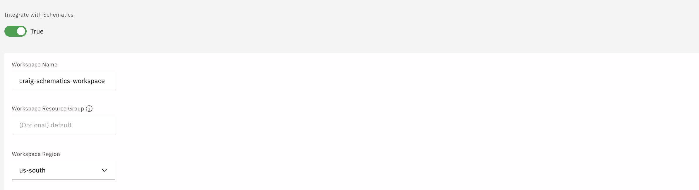

# Integrate Schematics with CRAIG
Using [IBM Cloud Schematics](https://cloud.ibm.com/docs/schematics?topic=schematics-getting-started) with CRAIG can be powerful way to automate and manage Infrastructure as code deployments. With Schematics you don't have to worry about setting up and maintaining the Terraform command-line and the IBM Cloud Provider plug-in. IBM Cloud Schematics stores and securely manages the state file generated by the Terraform engine in a Schematics Workspace and have multiple user use workspace to manage lifecycle of cloud environment. Schematics is also fully integrated into the IBM Cloud support system. 

## Prerequisites

### API_KEY set in CRAIG's environment
The `API_KEY` variable must be set in the `.env`. If CRAIG is deployed in IBM Code Engine, the API key will automatically be set in CRAIG's environment. The user or service ID owning the API key must have the following authorization policies.

### Access Policy
In order to allow Schematics integration, users should make sure they have the following access policy roles for the Schematics service:
>* `Manager` Service access
>* `Editor` or greater Platform access

These roles allow the integration with Schematics including the Schematics workspace creation and the upload of the project. However, to create and manage the IBM Cloud resources in the template, you must be assigned the IAM platform or service access role for the individual IBM Cloud resources that are in the template. See the IBM Cloud documentation for the various services for specific roles required.

Refer to the [User permissions for Schematics Workspaces documentation](https://cloud.ibm.com/docs/schematics?topic=schematics-access) for more information.

## Steps to integrate Schematics
To enable your project with Schematics:
1) Click on the Projects (folder) in the left navigation bar.
2) Click on the "Edit Project Details" button for your project
3) Enable `Integrate with Schematics` to integrate CRAIG with schematics. You may need to scroll down to see this control.
4) Enter a workspace name. This name will identify this project in the Schematics in IBM Cloud.
5) Click `Save Project and Workspace`. This will create the schematics workspace in your account.

## Upload the project to Schematics
To upload the project to Schematics in your cloud account, click the `Upload to Schematics` button. This will archive terraform code generated on CRAIG and upload to schematics workspace. 

4) Click on `Launch workspace in new Tab`. This will take you to the workspace where Terraform project has been uploaded. 

## Working with Schematics in IBM Cloud
On Schematics Workspace console, Click on `Settings` menu item on left. You will see there are list of variables listed. You need to edit the `ibmcloud_api_key` variable using the 3 dots on the right. Set the API key that will be used for creation of the PoC resources and mark it as Sensitive. The API key can be different from the API key that is used for CRAIG to Schematics integration. The API key used set in this variable must have the IAM access policies to allow it to create and manage the resources in the template. See [Access Policies](access-policies.md) for access policies and account settings required for creating and managing resources created in CRAIG projects.

You can click on `Generate Plan` to generate Terraform resource plan which will list all the cloud services which will be provisioned on execution of this code. Clicking on `Apply Plan` will execute the Terraform code and provision cloud services. 

You can manage lifecycle of provisioned cloud services from within schematics. If you would like to `Destroy` all services, click on `Actions` > `Destroy resources` this will deprovision all provisioned services. You can also `Delete workspace` on completion. 

## Cost estimation
Schematics estimates the cost of the resources as part of the `Generate Plan` step. Once the Generate plan step is complete, a `View cost estimate` button will appear on the `Generate Plan Successsful` job listed on the `Jobs` menu item of the workspace: . Clicking this button will show a cost estimate broken down by resource type.
